# Sign Language Project (MVA 2020-2021 / Object Recognition and Computer Vision)

In this repo, we try to improve the performance of [Sign Language Transformers](https://www.cihancamgoz.com/pub/camgoz2020cvpr.pdf)[1] by explicitly or implicitly modelling the body pose (e.g. hands, face, upper body).
The aim was the extend the method of [1] by using an automatic pose estimation obtained by [DOPE](https://arxiv.org/abs/2008.09457)[2]

The codes are mainly based on the [Sign Language Transformers Repo](https://github.com/neccam/slt) and [DOPE repo](https://github.com/naver/dope)
 
## Requirements
* Data features are available on drive (I will post soon the link).

* Install required packages using the `requirements.txt` file.

    `pip install -r requirements.txt`

## ToDo:

- [ ] GoogleDrive link for models/data
- [ ] A detailed and better written report
- [ ] A detailed description of the repository

**Note** : Experiments were made on COLAB (gpu : TESLA V100)

## First Step - Reproducing the result
We try to reproduce the result of [1]. We didn't get the best with loss recognition weight = 5.0 as it is mentioned in the paper
but with Loss Recognition Weight = 3.0 (we choose this value for the rest of our project)
The table below represents the best result we get :
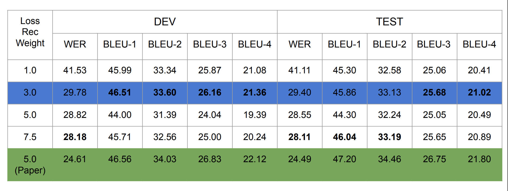

## Second Step - Get the additional inputs
We used a compressed version of the Phoenix2014 dataset as we were a bit limited in terms of ressources.
For each video (train, dev & test set), we decompose it into several frames and for each frame we apply the DOPE model
to obtain  all the keypoints (2D : Hand, Face, Body / 3D : Hand, Face, Body)  but also the features extracted by the CNN just before the 
ROI network, furthermore we apply an AdaptiveAveragePooling2D to get a vector of dim = 1024 (we couldn't just flatten the features, because it didn't fit in the memory)
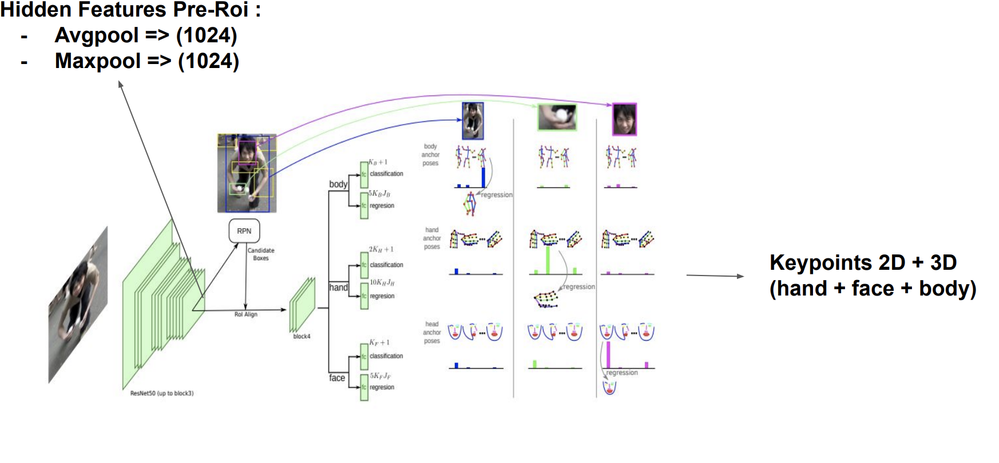

## Keypoints
**Note** : Before fusing, the Keypoints are passed to a Spatial Embedding Layer (purpose : normalize + embedding)
### Early Fusion
For each keypoint, the fusion of the sign_features (features obtained by the paper) and the keypoints is made just before
the encoder.

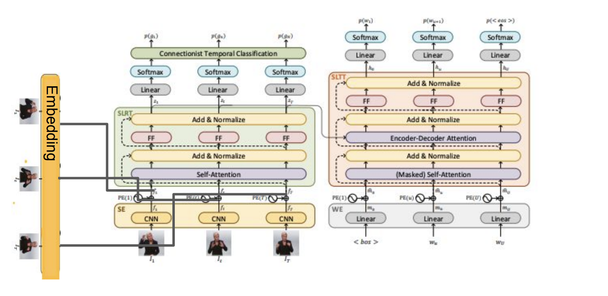

#### Concatenation
First, we tried to concatenate the keypoints embedding with the sign_features_embedding.
The table below represents the  result we got :
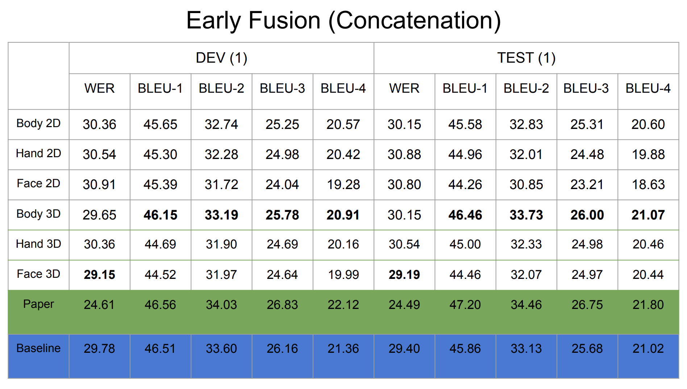

#### Addition
Second, we tried only to add the keypoints embedding to the sign_features_embedding.
The table below represents the  result we got :

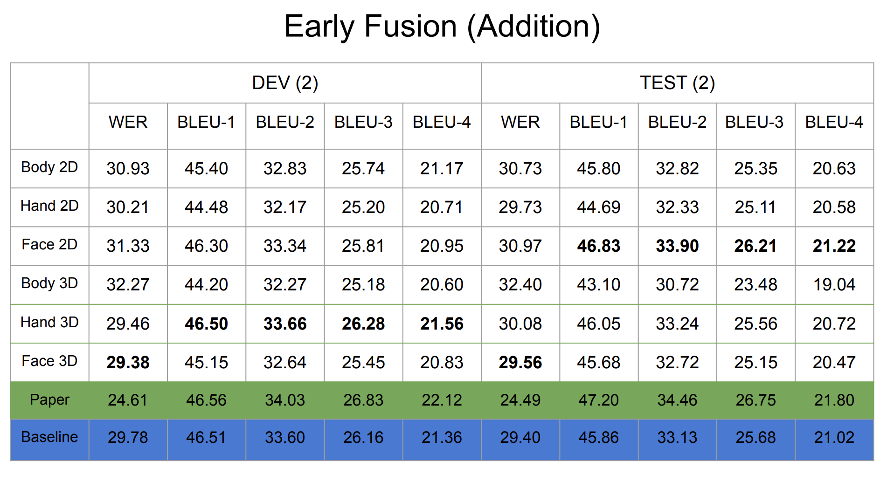

Furthermore, we also tried different combinations between keypoints.
The table below represents the  result we got : (H stands for Hand, B for Body, F for Face)

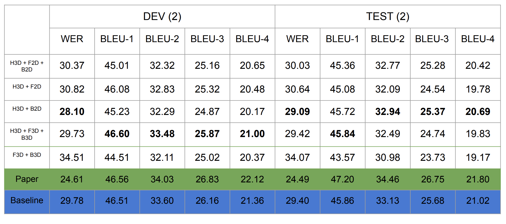

### Late Fusion
For each keypoint, the fusion of the sign_features (features obtained by the paper) and the keypoints is made just after
the encoder.

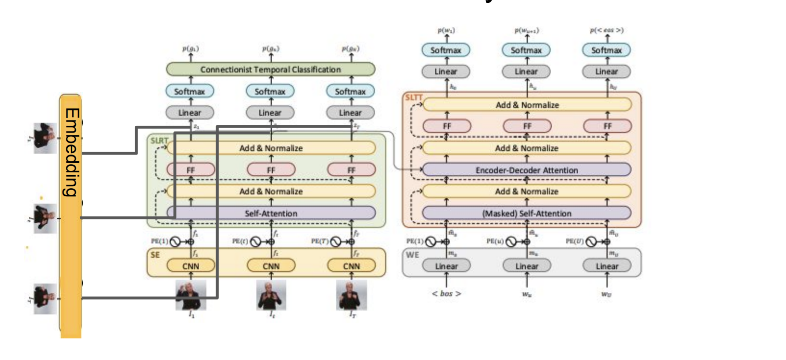

#### Addition
We only tried addition.
The table below represents the result we got :

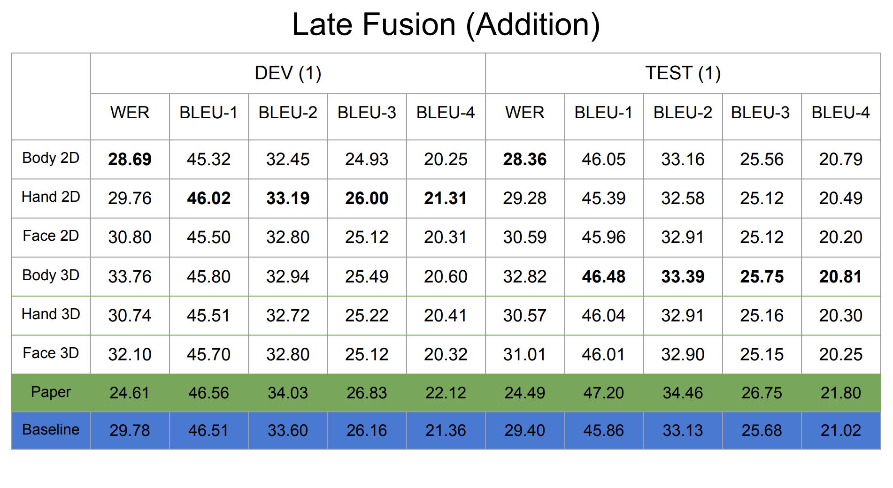

Furthermore, we also tried different combinations between keypoints.
The table below represents the  result we got : (H stands for Hand, B for Body, F for Face)

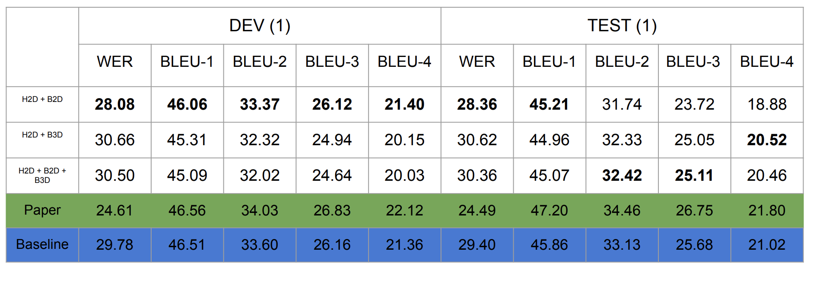

## Hidden Features Pre-ROI
**Note** : Before fusing, the Hidden Features are passed to a Spatial Embedding Layer (purpose : normalize + embedding)

### Early Fusion
#### Concatenation (Concat)
First, we tried to concatenate the hidden_features_embedding with the sign_features_embedding.

#### Hidden Encoder (Hidden)
Secondly, the hidden_features_embedding were given to the encoder as the hidden state.

The table below represents the result we got :

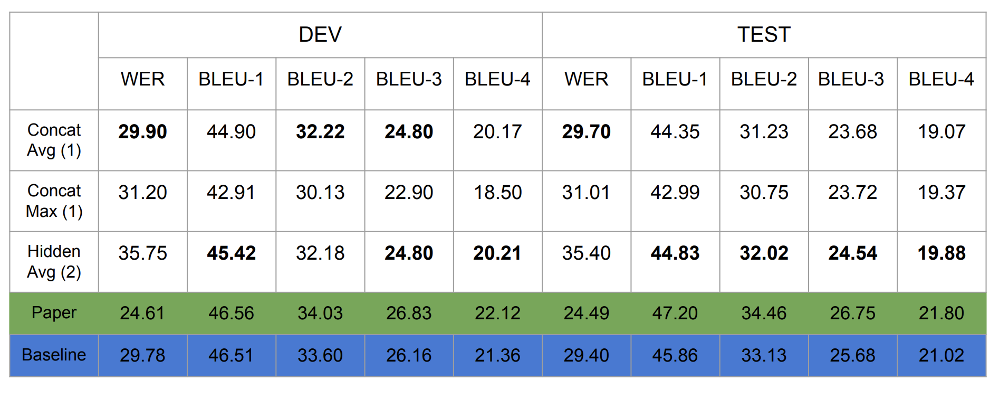

### Late fusion
For the late fusion, we only did the addition method after the encoder and we have weighted each one of them :
 output =  𝛂 * f_sign_encoder + 𝛄 * f_HiddenFeatures_embedding
We try different value of 𝛄 & 𝛂.
The table below represents the result we got (LRW = Loss Recognition Weight):

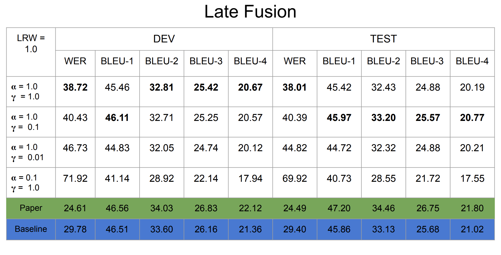

We also tried for the best values, different LRWs
The table below represents the result we got:

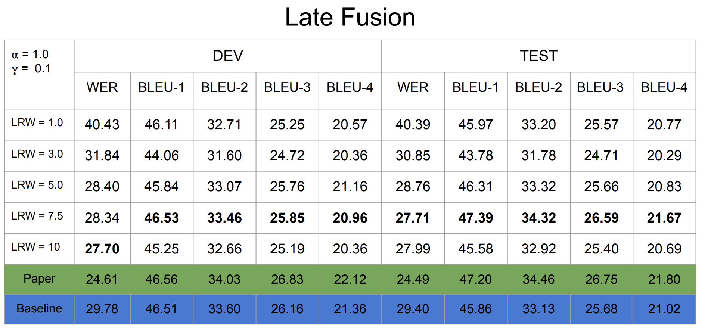

## Paragraphs
We also tried inputting a paragraph instead of a single sentence at a time.
The table below represents the result we got:

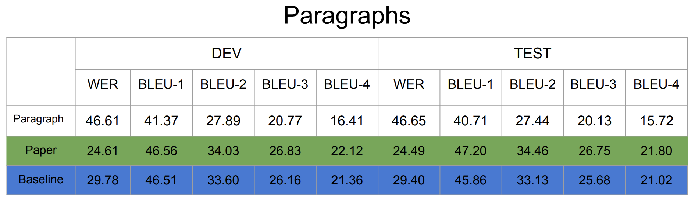

## Reference
<a id="1">[1]</a> 
Necati Cihan Camgoz and Oscar Koller and Simon Hadfield and Richard Bowden (2020) /
Sign Language Transformers: Joint End-to-end Sign Language Recognition and Translation / IEEE Conference on Computer Vision and Pattern Recognition (CVPR)

<a id="1">[2]</a> 
Weinzaepfel, Philippe and Br\'egier, Romain and Combaluzier, Hadrien and Leroy, Vincent and Rogez, Gregory (2020) /
DOPE: Distillation Of Part Experts for whole-body 3D pose estimation in the wild/ ECCV

